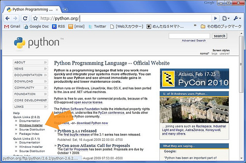
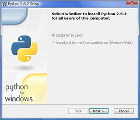

=================================
How to install on Windows
=================================

Intall Python
======================

Almost every Windows user do not have Python, we begin Python
installation. If you already install python, please skip this section.

Go to http://python.org . This site is a headquarter of the
Python. Look at Left sidebar and "Quick Links", Click "Windows
Installer" to download.

.. warning::

   Currently, Python has two version, 2.X and 3.X. Sphinx-1.1.3 can
   run under Python-3.2, but not Python-3.3. Python-2.6 and Python-2.7
   is still widely used, you may get some advice from ML or other
   places.

   This chapter assumes Python-2.6.

Follow the normal Windows installer, the Python install will be
completed.

After installation, you have better to add PATH to the Environment
Variable in order to run Python from Command Prompt.

* Right-Click the My Computer Icon and open Property Dialog
* Click Environment Variable button under detail tab
* Edit and add the path to the system variables PATH 

Add these variables. This is for Python-2.6. If you use Python2.5 or
2.7, change the "26" number. Add these pathes separeted by ";".

.. list-table:: Adding PATH
   :widths: 10 40
   :header-rows: 1
   
   * - PATH
     - description
   * - C:¥Python26
     - Folder which includes Python Command
   * - C:¥Python26¥Scripts
     - Folder which includes easy_install (described later) or sphinx commands

Run **Command Prompt** or enter ``cmd`` to the "search program and
files" text box. After command prompt window appear, type
``python[Enter]``. If you can get installed python version and prompt
about ``>>>``, the Python installation is succeeded.  Enter ``Ctrl+Z``
key to quit.

.. _install_easy_install:

Instll easy_install command
==================================

Python has very useful ``easy_install`` command which install 3rd
party library. easy_install downloads and install software which you
want to need by only one command.

* http://peak.telecommunity.com/dist/ez_setup.py

Save above link by Right-click. Some browsers can download just open
the URL. If you can read the file iteslf, calm down, Right-click and
choose "Save".

After download, run Command Prompt, go to the ez_setup.py, run this command.

.. code-block:: bat

   > python ez_setup.py

Now ``easy_insall`` command is installed. OK, Let's go to the Sphinx install!

.. _install_sphinx:

Install Sphinx
====================

If you finshed easy_install install, for the rest is just a
moment. Type this line.

.. code-block:: bat

   > easy_install sphinx

Done. After installation, Type ``sphinx-quickstart`` on the Command
Prompt. If you get interactive messages which are described at
:ref:`sphinx_quickstart`, installation is succeeded. Quit by hitting
``Ctrl+C``. 

Next, go to :doc:`make_project`.
