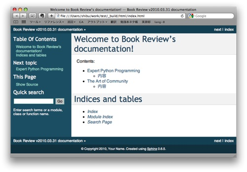

==================
Making Project
==================

Run ``sphinx-quickstart``
===========================

..
  Sphinxでプロジェクトを作成するには、以下のようにタイプします。

To create a sphinx project, type blow.

.. code-block:: bash

   $ sphinx-quickstart

..
  いくつか質問されます。絶対に回答しなければならないのは、次の項目です。後はEnterキーだけで大丈夫です。

Sphinx-quickstart commands asks some of questions. You must enter at
least three items. Other questions are just type "Enter" key.

1. Project Name
2. Version
3. Author Name

..
  今回は、自分の書評ページなので、プロジェクト名は ``"Book Review"`` 、バージョン番号は今日の日付、著者名には自分の名前を入れましょう。

This is my own bookreview page, let's set ``"Book Review"`` as project name, today  as version and my name as author.

.. toctree::
   
   sphinxquickstart

Let's make page structure
=========================

..
  ひな形ができたので、次にページを足して、ドキュメントを作成していきます。など、ここでは上記の質問で、ディレクトリ設定に関してはデフォルト(ソースとビルドを分けない、プリフィックスは ``_``)であるとします。

Now you have created an document skeleton. Let's add some pages and create whole document.

.. note::
   This assumes default directory setting (not separete source and build directory and prefix is ``_``).

..
  "Expert Python Programming"と、"The Art of Community"という本を紹介したいとします。それぞれ、1ファイルに書くことにして、以下の様なページ構成にします::

I want to introduce "Expert Python Programming" and "The Art of Community", one revies by one file. The page structure is below::

   index.rst
     +- expert_python.rst
     +- art_of_community.rst

..
  Sphinxでドキュメントを書く場合には、何種類かのディレクティブ(命令)をドキュメントの中に入れていきますが、その中でも一番重要なディレクティブが ``.. toctree::`` です。これは、文章の親子関係を定義するディレクティブです。マスタードキュメントである、 ``index.rst`` には既にこのディレクティブがありますので、そこに項目を追加します。なお、このファイルの先頭数行はコメントですので、省略してあります。

When you make a document by Sphinx, you write some directives in the
document. The most important directive is ``.. toctree::`` .  This
directive defines the document tree structure.  ``index.rst`` which is
master document already has this toctree directive, let's add some
items. We omit some header lines of index.rst file because these are
just a comment.

**index.rst:**

.. code-block:: rst
   :linenos:

   Welcome to Book Review's documentation!
   =======================================

   Contents:

   .. toctree::
      :maxdepth: 2

      expert_python
      art_of_community

   Indices and tables
   ==================

   * :ref:`genindex`
   * :ref:`modindex`
   * :ref:`search`

.. note::
   You should insert "Empty Line" between ``:maxdepth:`` and file names. And you should not write a file extention such as ".rst".

..
  それでは、子供のファイルも作ってみましょう。なお、日本語を入力する場合、文字コードはUTF-8エンコードにします。

Next, write child files. 

.. note::

   Charactor encodings should be UTF-8.

**expert_python.rst:**

.. code-block:: rst
   :linenos:

   =========================
   Expert Python Programming
   =========================

   :Author: Tarek
   :Publisher: Packt Publishing

   Description
   ================

   Expert Python Programming is for the python experts. It describes
   how to use non-major python functions, using test tools to build
   application, continous integration and so on with a lot of
   citations about algorithms inside python.

**art_of_community.rst:**

.. code-block:: rst
   :linenos:

   ====================
   The Art of Community
   ====================

   :Author: Jono Bacon (Ubuntu Linux community manager)
   :Publisher: O'reilly

   Description
   ================

   This describes community management. How to create community, tools
   for community management, how to measure community, management
   organization. What's more, how to make Buzz, physical event, or how
   to find sponsers. All topics are backed by a great deal of experience.

..
  ファイルができたら、下記のコマンドを実行して、HTMLファイルを作ってみましょう。

Once you finish editing the file, execute this command to create HTML files.

.. code-block:: bash

   $ make html

..
  ``_build/html`` フォルダ内にHTMLが生成されます。おめでとうございます！これがSphinxで生成したドキュメントになります。

The HTML files are created in the ``_build/html``. Congratulation! This is the document which is created by Sphinx.

..
  HTMLを見ると、ページのタイトルがtoctreeディレクティブのあるところに子供のページのタイトルが表示されていることが分かります。次は、このメカニズムを見ていきます。Sphinxで一番重要なのが、このtoctreeの仕組みを知ることです。

You can see the titles of child pages are put on the toctree directive. This toctree mechanism is a most important thing of the Sphinx.

Inside of toctree
=============================================

..
  Sphinxのすべてのページにはセクションタイトルが含まれます。

All of Sphinx pages include a section title.

..
  先に挙げた、3つの例では、セクションのタイトルとして、 ``=`` 記号を使っ
  ていることが分かります。Sphinxでは、 ``#``, ``*``, ``=``, ``-``,
  ``^``, ``~``, ``"`` などの記号を使うことができます。記号は上下に記号
  を並べる方式と、アンダーラインのようにする方式の2つがあります。記号の
  種類と書き方(上下、下のみ)で色々なフォーマットが実現できますが、1つの
  ファイル内の登場順で、レベルが決まり、階層化されます。上記のサンプル
  では、子供ファイルのタイトル(``=`` の上下)がレベル1, 内容と書かれてい
  る部分(``=`` の下だけ)がレベル2になります。

The three examples listed above use ``=`` as a section title. In the
Sphinx, you can use ``#``, ``*``, ``=``, ``-``, ``^``, ``~``,
``"``. There are two way to write section title. One is write
underlining and overlining, other is only overlining. These two way
make different section level.

And also different charactor creates different section level. Section
level is defined the order in the file. At the examples listed above,
a title (underlining and overlining ``=``) is level 1, contents (only
underlining ``=``) is level 2.

For the Python documentation, this convention is used which you may follow::

- ``#`` with overline, for parts
- ``*`` with overline, for chapters
- ``=``, for sections
- ``-``, for subsections
- ``^``, for subsubsections
- ``"``, for paragraphs

..  
  toctreeディレクティブは、子供のセクションタイトル情報を持ってきて、
  目次を作ります。ここでは ``maxdepth`` オプションが2なので、レベル2ま
  でのタイトルを持ってきます。この仕組みのおかげで、ある程度の深さを持っ
  たドキュメントであっても、見通しが良くなり、情報が探しやすくなります。

toctree directive retrieves child section title and make table of
contents. In this time ``maxdepth`` option is 2, toctree make title
until level 2. This enables the document easy to find desired
information even the document has deep structure.

.. 
  また、toctreeは1ページにいくつも書くことができます。また、toctreeが
  書かれている場所のセクションタイトルのレベルの影響も受けます。
  toctreeの位置のセクションタイトルのレベルが2であれば、子供のドキュメ
  ントのレベル1, レベル2のセクションタイトルは、親ドキュメントのレベル
  3, レベル4相当として扱われます。以下の図がこれを説明したサンプルです。
  このドキュメント全体を ``maxdepth 2`` としてtoctreeで子供に設定すると、
  孫のレベル1のタイトルを含め、赤字のタイトルまでが取り込まれることにな
  ります。

You can set multiple toctrees in one page. And section title level
where toctree is placed also affects.  If section title where toctree
is placed is level 2, level 1 of child document and level 2 of section
title is used for level 3 and level 4 of parent document.

Below image shows this. If you set toctree as ``maxdepth 2``, toctree
includes level 1 title of grandchild and also red colored titles.

.. note::

   If a file has no section title, warning will be displayed.

..
  それでは、次に、 :doc:`Sphinxのドキュメントをパワーアップさせる <use_markup>` 、各種マークアップやディレクティブを紹介します。

Next, go to :doc:`make your Sphinx document more powerful <use_markup>` which introduces some markups and directives.

